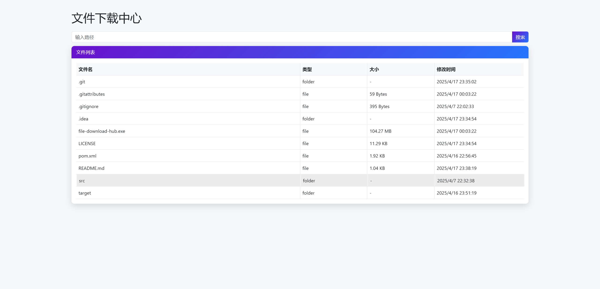

# 📂 File Download Hub

[](https://github.com/azirzsk/FileDownloadHub/blob/main/LICENSE)
[](https://www.java.com)

FileDownloadHub 是一个基于Spring Boot的文件下载中心，提供文件列表查看和文件下载功能。

## ✨ 功能特性

- 文件目录浏览
- 文件下载（支持断点续传）
- 文件/文件夹类型区分
- 请求追踪和日志记录
- Swagger API文档支持

## 🔧 环境要求

- JDK 17 或更高版本
- Maven 3.6+

## 📦 快速开始

### 1. 配置项目

在`application.yml`中配置基础路径：

```yaml
file:
  basePath: /path/to/your/files
```

### 2. 构建并运行

```bash
mvn clean package
java -jar target/file-download-hub.jar
```

或者使用GraalVM构建原生镜像：

```bash
mvn -Pnative native:compile
./target/file-download-hub
```

### 3. 首页
在浏览器中访问`http://localhost:8080`，即可看到首页。



## 🛠️ 配置
基础路径:
```bash
# Windows
set file.basePath=C:\path\to\your\files

# Linux/MacOS
export file.basePath=/path/to/your/files
```